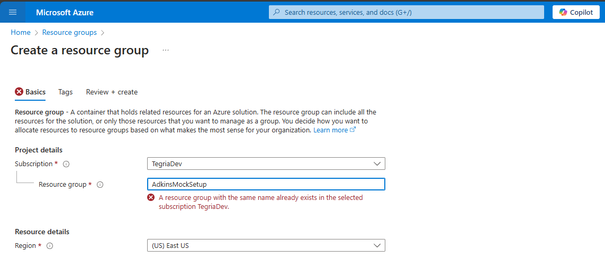
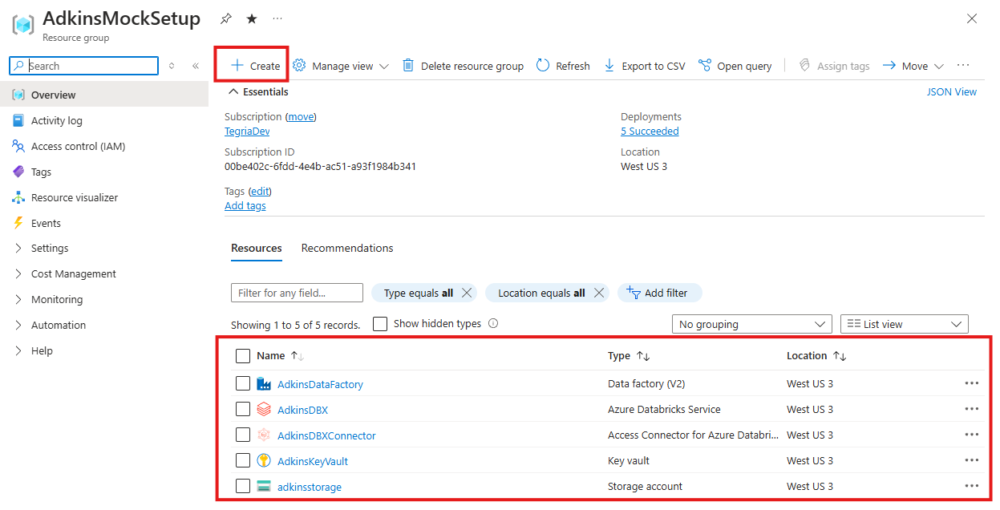
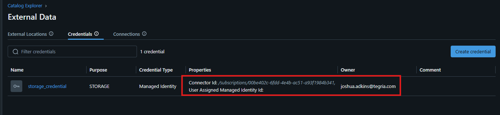
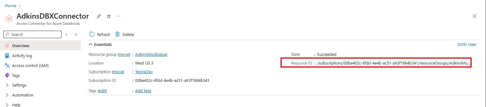
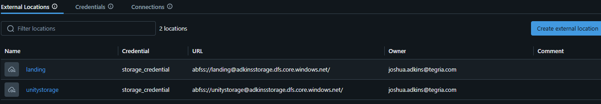
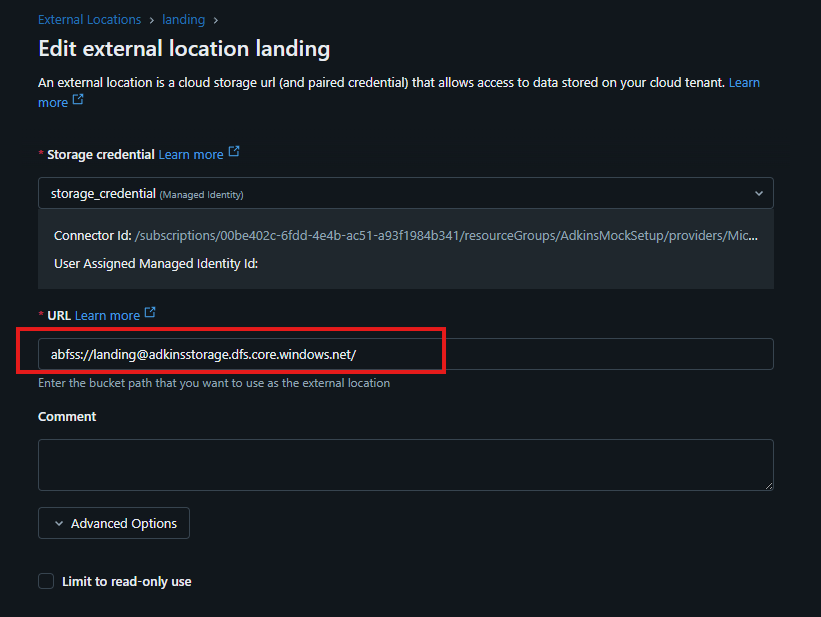
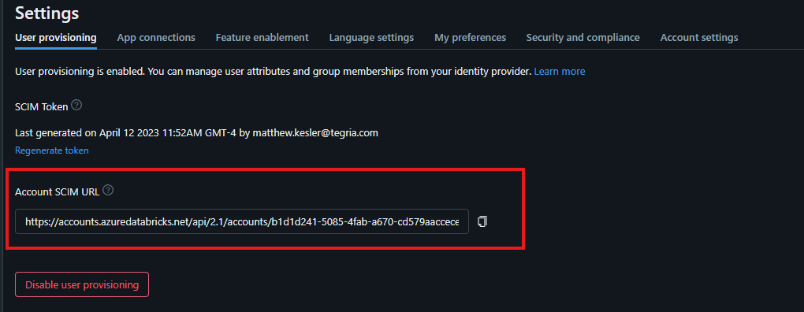
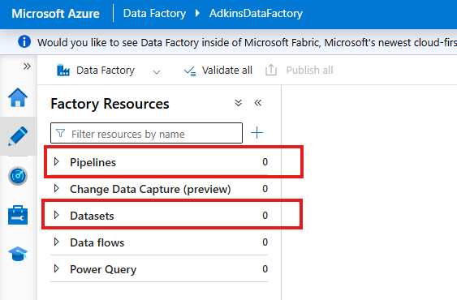
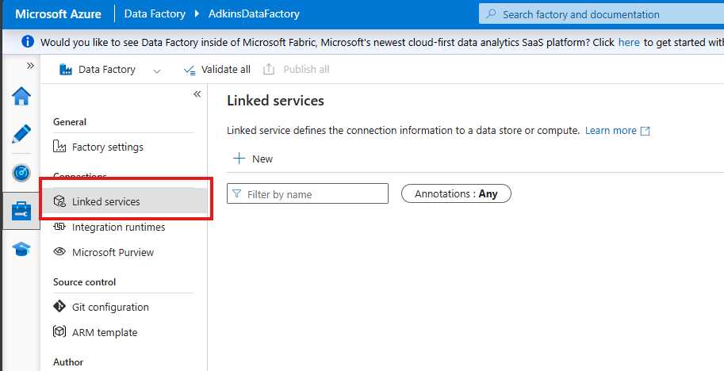

Data Engineer's Checklist for Setting Up a MDP Environment in Azure
=================================================================
*(A special note - this is a basic guide - no private enpoints no stringent security rules - these things are difficult to predict as they vary client by client. However, regardless of the approach the steps are very similar in terms of what you will need to get started.) If you need more guidance, feel free to reach out to me at business.joshadkins@gmail.com.

##### Prefix: All resources can be referenced and observed by looking at the  [AdkinsMockSetup - Microsoft Azure](https://portal.azure.com/#@tegriadev.onmicrosoft.com/resource/subscriptions/00be402c-6fdd-4e4b-ac51-a93f1984b341/resourceGroups/AdkinsMockSetup/overview) Resource Group

Step 1: Sign In to Azure Portal
-------------------------------

*   [ ] Navigate to the [Azure Portal](https://portal.azure.com/).
*   [ ] Sign in with your Azure account credentials.
* * *

Step 2: Create a Resource Group
-------------------------------

*   [ ] In the Azure Portal, click **Create a resource group**.
*   [ ] Search for "Resource group" and select **Create**.
*   [ ] Enter the following details:
    *   **Subscription**: Choose the appropriate subscription.
    *   **Resource group**: Name the resource group (ex. "AdkinsMockSetup").

* * *

Step 3: Add Fundamental Resources to the Resource Group
-------------------------------------------------------

*   [ ] In the resource group page, select **Create** to add each of the following resources:
    *   [ ] Data Connector for Databricks
    *   [ ] Storage Account (ADLS Gen2) - **IMPORTANT** You must upgrade it from blob storage to ADLS Gen2 via enable hierarchical organization.
    *   [ ] Databricks Resource
    *   [ ] Key Vault
    *   [ ] Azure Data Factory

* * *

Step 4: Configure Permissions (Non-Exhaustive)
----------------------------------------------

*If possible, assign roles and permissions at the resource group level so they are inherited, otherwise permissions have to be allocated resource by resource.*
*   **Developers**:
    *   [ ] Contributor
    *   [ ] Key Vault Administrator
    *   [ ] Storage Blob Data Owner
*   **Storage**:
    *   [ ] Databricks Connector:
        *   [ ] Key Vault Administrator
        *   [ ] Storage Blob Contributor
*   **Databricks**:
    *   [ ] Databricks Connector:
        *   [ ] Key Vault Administrator
*   **Key Vault**:
    *   [ ] Databricks Connector:
        *   [ ] Key Vault Administrator
*   **Azure Data Factory**:
    *   [ ] Assign necessary permissions.
* * *

Step 5: Unity Catalog Setup (Databricks)
----------------------------------------

### Adding a Metastore

*   [ ] Follow [this guide](https://learn.microsoft.com/en-us/azure/databricks/data-governance/unity-catalog/create-metastore) to create a metastore.
    *   **Summary**:
        *   [ ] Go to **Account Manager**.
        *   [ ] Create a metastore catalog.
        *   [ ] In **Workspaces**, assign the workspace to the catalog.

### Linking Databricks Connector

*   [ ] In the catalog, navigate to **External Data** > **Credentials**.
*   [ ] Select **Create Credential** and link it using the connector ID (starts with `/subscriptions/...`).

### Adding External Data Locations

*   [ ] Create external locations to enable dynamic read/write access without mounting in notebooks.
*   [ ] Set up one external data location per storage container, with appropriate permissions for developers.

This image shows that its connected to the landing container in the storage account.

### Enabling SCIM Provisioning (System for Cross-Domain Identity Management)

Purpose: To sync AD groups from Azure into Databricks.
*   [ ] Generate SCIM provisioning details (URL and token) from the DBX account management portal under **Settings**.
*   [ ] Add the **Azure Databricks SCIM Provisioning Connector** to **App Registrations** in Microsoft Entra ID.
*   [ ] Verify that AD groups sync automatically to Databricks.
[Sync users and groups from your identity provider | Databricks on Azure] [Sync users and groups from Microsoft Entra ID - Azure Databricks | Microsoft Learn](https://learn.microsoft.com/en-us/azure/databricks/admin/users-groups/scim/)

* * *

Step 6: Configure Key Vault
---------------------------

*   [ ] Manage secrets, keys, and certificates in Key Vault.
*   [ ] Set access policies for permissions.
*   [ ] Link Key Vault to Databricks Secret Scope to access secrets within Databricks notebooks.
* * *

Step 7: Configure Azure Data Factory
------------------------------------

*   **For Each Service (e.g., ServiceNow)**:
    *   [ ] Create a **Linked Service** with parameters to connect to the service.
    *   [ ] Set up a **Dataset** to define interactions with the Linked Service.
    *   [ ] Build a **Pipeline** to move data from source to destination.

* * *

### Testing

*   [ ] Test access and functionality for each resource.
*   **Note**: If something is not working, it is likely due to a security permission issue.